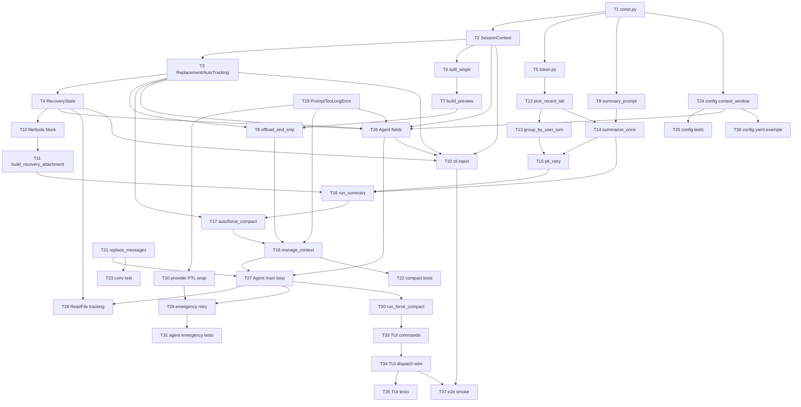

# 上下文管理 Tasks

本章把"两层压缩 + 压缩后恢复 + 手动 / 紧急入口"按 plan 的模块切分落到代码上。任务粒度控制在 2~5 分钟一个，每个任务都自包含：可以读完任务直接动手，不需要回看 plan。任务之间通过"依赖"字段标明顺序。

## 文件清单

| 文件路径 | 类型 | 职责 |
|----------|------|------|
| `src/mewcode/compact/__init__.py` | 新建 | 重导出 `manage_context` / `TriggerKind` / 几个 State 类型 |
| `src/mewcode/compact/const.py` | 新建 | 全部硬编码常量 |
| `src/mewcode/compact/state.py` | 新建 | `ContentReplacementState`（含 `decide_once`）/ `AutoCompactTrackingState` / `RecoveryState` / `SessionContext` |
| `src/mewcode/compact/token.py` | 新建 | `estimate_tokens` / `usage_anchor` / `message_chars` |
| `src/mewcode/compact/layer1.py` | 新建 | `offload_and_snip` / `spill_single` / `build_preview` |
| `src/mewcode/compact/summary_prompt.py` | 新建 | `build_summary_prompt` / `serialize_conversation` / `extract_summary` / 9 部分模板 |
| `src/mewcode/compact/recovery.py` | 新建 | `build_recovery_attachment` / `render_file_block` / `render_tools_block` / `BOUNDARY_NOTICE` |
| `src/mewcode/compact/layer2.py` | 新建 | `auto_compact` / `force_compact` / `run_summary` / `summarize_once` / `ptl_retry` / `pick_recent_tail` / `group_by_user_turn` |
| `src/mewcode/compact/compact.py` | 新建 | `manage_context` / `TriggerKind` 枚举 / 编排 |
| `tests/compact/test_*.py` | 新建 | 各模块对应单测 |
| `src/mewcode/llm/__init__.py` | 修改 | 新增 `class PromptTooLongError(Exception)` 哨兵异常（`ToolDefinition` 已是导出类型，无需改动） |
| `src/mewcode/llm/anthropic_provider.py` | 修改 | 把 provider 上下文过长异常包装成 `PromptTooLongError` 并通过 `yield StreamEvent(err=...)` 投递 |
| `src/mewcode/llm/openai_provider.py` | 修改 | 同上 |
| `tests/llm/test_anthropic_provider.py` | 修改/新建 | PTL 异常包装单测 |
| `tests/llm/test_openai_provider.py` | 修改/新建 | PTL 异常包装单测 |
| `src/mewcode/conversation.py` | 修改 | 加 `_lock = threading.RLock()`；新增 `replace_messages(msgs)` 深拷贝整体替换 |
| `tests/test_conversation.py` | 修改 | 增加 `replace_messages` 用例 |
| `src/mewcode/config/config.py` | 修改 | `ProviderConfig` 追加 `context_window: int = 0` + 模块级函数 `effective_context_window(p)` |
| `src/mewcode/config/protocol_defaults.py` | 新建 | `DEFAULT_ANTHROPIC_CONTEXT_WINDOW` / `DEFAULT_OPENAI_CONTEXT_WINDOW` 协议默认值常量 |
| `tests/test_config.py` | 修改 | 4 种情况断言 + `yaml.safe_load` `.mewcode/config.yaml.example` 通过的解析测试 |
| `src/mewcode/agent/runtime.py` | 新建 | `SessionRuntime` dataclass |
| `src/mewcode/agent/event.py` | 新建 | `CompactPhase` / `CompactEvent`；`Event` dataclass 追加 `compact` 字段 |
| `src/mewcode/agent/agent.py` | 修改 | `__init__` 接受 `runtime` 关键字参数；`_stream_once` 签名改为返回 err；主循环集成 compact、ReadFile 追踪、PTL 紧急压缩、`run_force_compact`、`_run_lock` 互斥锁 |
| `tests/agent/test_agent.py` | 修改 | fake_provider 扩展 + 紧急压缩两用例 |
| `src/mewcode/tui/commands.py` | 新建 | 命令分发 + `/exit` / `/plan` / `/do` / `/compact` 处理器 + 未知命令兜底 |
| `src/mewcode/tui/app.py` | 修改 | `MewCodeApp` 新增 `runtime: SessionRuntime` 与 `agent: Agent` 字段；`__init__` 构造期一次性构造 Agent |
| `src/mewcode/tui/stream.py` | 修改 | `submit()` 内原 match 改用 `dispatch_command` |
| `tests/tui/test_tui.py` | 修改 | 5 组用例:`/compact` 路由到命令分发、`/unknown` 友好提示、迁移后 `/exit` / `/plan` / `/do` 各一组不回归 |
| `src/mewcode/cli.py` | 修改 | 启动期构造 `SessionRuntime` 注入 TUI；待 provider 选定后再注入 `context_window` |
| `scripts/smoke.py` | 修改 | 按新 Agent 构造签名传入 `SessionRuntime`（smoke 场景 `context_window=200000`） |
| `.mewcode/config.yaml.example` | 修改 | 新增 `context_window` 字段示例与注释 |
| `.gitignore` | 修改 | 追加 `.mewcode/sessions/` |

---

## T1 - 建立 compact 子包骨架与常量- **文件**：`src/mewcode/compact/__init__.py`、`src/mewcode/compact/const.py`
- **依赖**：无
- **步骤**：
  1. 新建目录 `src/mewcode/compact/`，添加空 `__init__.py`（后续按导出需求填充 `from .compact import manage_context, TriggerKind` 等）。
  2. 新建 `const.py`，定义全部硬编码常量：`SINGLE_RESULT_LIMIT = 50000`、`MESSAGE_AGGREGATE_LIMIT = 200000`、`SUMMARY_RESERVE = 20000`、`AUTO_SAFETY_MARGIN = 13000`、`MANUAL_SAFETY_MARGIN = 3000`、`RECOVERY_FILE_LIMIT = 5`、`RECOVERY_TOKENS_PER_FILE = 5000`、`RECENT_KEEP_TOKENS = 10000`、`RECENT_KEEP_MESSAGES = 5`、`MAX_CONSECUTIVE_AUTO_COMPACT_FAILURES = 3`、`PTL_RETRY_LIMIT = 3`、`PTL_DROP_PERCENTAGE = 0.2`、`ESTIMATE_CHARS_PER_TOKEN = 3.5`、`PREVIEW_HEAD_BYTES = 2048`、`PREVIEW_HEAD_LINES = 20`。
  3. 每个常量上方写一行简短中文注释，说明数字含义。注释不写"参考"、"取自"等外部引用语。
- **验证**：`python -c "from mewcode.compact import const"` 不报错；`ruff check src/mewcode/compact/` 无告警。

## T2 - SessionContext 与目录创建- **文件**：`src/mewcode/compact/state.py`
- **依赖**：T1
- **步骤**：
  1. 创建 `state.py`，文件头按 PEP 8 写好 `from __future__ import annotations` 与导入分组。
  2. 定义 `@dataclass class SessionContext` 字段：`session_id: str` / `spill_dir: str`。
  3. 实现模块内 `_new_session_id() -> str`：
     - 用 `secrets.token_hex(4)` 拿 8 字符短随机串（失败极少见；若必须考虑兜底可 `try/except` 后退 `random.Random(time.time()).randbytes(4).hex()` 并写一条 warning 日志）。
     - 返回 `f"{int(time.time())}-{hex_str}"`。
  4. 实现 `new_session_context(workspace: str) -> SessionContext`：
     - 调 `_new_session_id()` 拿到 `session_id`。
     - 拼接 `spill_dir = str(Path(workspace) / ".mewcode/sessions" / session_id / "tool-results")`。
     - 调 `Path(spill_dir).mkdir(parents=True, exist_ok=True)`；目录已存在不算错误。
     - 返回构造好的实例。
  5. 文件头部 import 按 `ruff format` / `isort` 规则分组（标准库、第三方、本地）。
- **验证**：`python -c "from mewcode.compact.state import new_session_context; print(new_session_context('.'))"` 输出合理；T22 增加 `test_new_session_context_rand_fail_fallback`（通过 monkeypatch 注入 `secrets.token_hex` 失败模拟）覆盖降级路径。

## T3 - ContentReplacementState 与 AutoCompactTrackingState- **文件**：`src/mewcode/compact/state.py`
- **依赖**：T2
- **步骤**：
  1. 在 `state.py` 中追加 `ContentReplacementState` 类：`__init__` 内 `self._lock = threading.RLock()`、`self._seen_ids: set[str] = set()`、`self._replacements: dict[str, str] = {}`。属性以 `_` 开头不导出。
  2. 给类加唯一高层方法：

     ```python
     def decide_once(
         self,
         tool_use_id: str,
         original: str,
         decide: Callable[[], tuple[str, str]],  # 返回 (decision, preview)
     ) -> str:
         """持锁完成"查账本 → 决策 → 写账本"原子操作。

         若 id 已 Seen：直接返回账本中存量结果（kept 返回原 content，
         replaced 返回 _replacements[id]）。
         若 id 未 Seen：调 decide() 回调（仍持锁）：
           - 回调返回 ("kept", _)：写 _seen_ids，不写 _replacements；返回原 content。
           - 回调返回 ("replaced", preview)：写 _seen_ids + _replacements；返回 preview。
           - 回调返回 ("skip", _)：既不写 _seen_ids 也不写 _replacements；返回原
             content（下一轮重试）。
         """
     ```

     注意 `_seen_ids` 与 `_replacements` 两本结构的写入必须在同一临界区内完成（持 `_lock` 期间），避免出现"已 Seen 但 replacement 未写"的中间态。
  3. 定义 `AutoCompactTrackingState` 类：`__init__` 内 `self._lock = threading.RLock()`、`self._consecutive_failures = 0`。
  4. 实现 `record_success()` / `record_failure()` / `tripped() -> bool`（`>= MAX_CONSECUTIVE_AUTO_COMPACT_FAILURES`），全部加锁。
- **验证**：`ruff check src/mewcode/compact/state.py` 干净；目测每个 `_lock` 写/读临界区均加锁；`decide_once` 是临界区入口。

## T4 - RecoveryState 与 FileReadRecord- **文件**：`src/mewcode/compact/state.py`
- **依赖**：T3
- **步骤**：
  1. 定义 `@dataclass class FileReadRecord`：`path: str` / `content: str` / `timestamp: datetime`。
  2. 定义 `RecoveryState` 类：`__init__` 内 `self._lock = threading.RLock()`、`self._files: dict[str, FileReadRecord] = {}`（键为绝对路径）。
  3. 实现 `record_file(self, path: str, content: str)`：加锁写入，若 path 不是绝对路径则 `str(Path(path).resolve())` 一次再存；写入时 `timestamp = datetime.now()`。
  4. 实现 `snapshot(self) -> list[FileReadRecord]`：加锁拷贝 dict，按 `timestamp` 倒序排序返回列表（`copy.copy(rec)` 或 dataclass 自带浅拷贝即可，因为 `FileReadRecord` 字段都是不可变类型）。
- **验证**：`pytest tests/compact/test_state.py::test_recovery_state_snapshot_order` 通过；自查 `snapshot` 返回的是拷贝，不暴露内部 dict。

## T5 - estimate_tokens 与 usage_anchor- **文件**：`src/mewcode/compact/token.py`
- **依赖**：T1
- **步骤**：
  1. 新建 `token.py`，import `math`。
  2. 实现 `usage_anchor(u: Usage) -> int`：返回 `u.input_tokens + u.output_tokens + u.cache_read + u.cache_write`（Python int 不溢出，无需特殊处理）。
  3. 实现模块内 `message_chars(msgs: list[Message]) -> int`：遍历每条 message，累加 `len(content.encode("utf-8"))` + 每个 `tool_calls[i].input` 用 `json.dumps(...)` 序列化后的字节长度（若已是 str 直接 encode）+ 每个 `tool_results[i].content` 的字节长度。考虑 `None` 安全。
  4. 实现 `estimate_tokens(anchor: int, all_msgs: list[Message], anchor_msg_len: int) -> int`：
     - 计算 `tail = all_msgs[anchor_msg_len:]`（若 `anchor_msg_len > len(all_msgs)` 则 tail 取空列表，防御性 `max(0, anchor_msg_len)` 处理）；
     - 返回 `anchor + math.ceil(message_chars(tail) / ESTIMATE_CHARS_PER_TOKEN)`。
     - 入参语义：`anchor` 是上一次主对话 stream 真实 usage 之和，`anchor_msg_len` 是当时 `conv.length()`；只对锚点之后追加到 conversation 的消息做字符增量估算，避免重复计算历史。
- **验证**：`pytest tests/compact/test_token.py` 通过；对 `anchor=0, all_msgs=[], anchor_msg_len=0` 返回 0；对 `anchor=1000, all_msgs=[m1, m2], anchor_msg_len=1`，结果 = `1000 + math.ceil(len(m2.content.encode())/3.5)`。

## T6 - 单条工具结果落盘 spill_single- **文件**：`src/mewcode/compact/layer1.py`
- **依赖**：T2
- **步骤**：
  1. 新建 `layer1.py`，导入 `Path` 与 `SessionContext`。
  2. 实现 `spill_single(session: SessionContext, tool_use_id: str, content: str) -> None`：
     - 拼接 `path = Path(session.spill_dir) / tool_use_id`。
     - 用 `path.exists()` 判断文件已存在则直接返回（幂等）。
     - 否则 `path.write_bytes(content.encode("utf-8"))`；失败让 `OSError` 自然抛出。
  3. 模块内 helper 用 `_` 前缀或仅在模块作用域内使用。
- **验证**：`ruff check src/mewcode/compact/layer1.py` 干净；手工写一个脚本测一次重复落盘，第二次 `st_mtime_ns` 不变（也可留到 T22 测试覆盖）。

## T7 - 预览体构造 build_preview- **文件**：`src/mewcode/compact/layer1.py`
- **依赖**：T6
- **步骤**：
  1. 实现 `_head_preview(content: str) -> str`：先按 `\n` 用 `splitlines(keepends=True)` 切成最多 `PREVIEW_HEAD_LINES` 行，再用 `"".join(...)` 拼回；若 `len(head.encode("utf-8")) > PREVIEW_HEAD_BYTES` 再做字节级二次截断（注意 UTF-8 边界对齐）。
  2. 实现 `build_preview(original_bytes: int, head: str, spill_path: str) -> str`：返回一个固定格式的多行字符串：
     - 第 1 行：`f"[content offloaded] original size: {original_bytes} bytes"`
     - 第 2 行：`f"[saved to] {spill_path}"`
     - 第 3 行：`"[head preview]"`
     - 后续若干行：`head` 内容
     - 末尾：固定文案"完整内容已保存到上述路径，如需查看请用文件读取工具读取该路径，不要凭头部预览猜测全文"
  3. 字符串构造用 `io.StringIO` 或 `"\n".join([...])`，保证逐字节稳定输出。
- **验证**：同一对入参连续两次调用 `build_preview` 返回完全相等字符串（`==` 比较即可，Python str 不可变）。

## T8 - offload_and_snip 主体- **文件**：`src/mewcode/compact/layer1.py`
- **依赖**：T3、T7
- **步骤**：
  1. 实现 `offload_and_snip(msgs: list[Message], state: ContentReplacementState, session: SessionContext) -> list[Message]`。
  2. 先深拷贝 msgs 到 `out`（`copy.deepcopy(msgs)` 或手动逐条复制 dataclass + 内部 list，避免改原列表）。
  3. 关键约束：仅遍历 `msg.role == "tool"` 的消息（mewcode 把一轮工具结果挂在 tool 消息的 `tool_results` 列表里，**不**在 assistant 消息里）。对每条 tool 消息独立处理其 `tool_results` 列表。
  4. 单遍扫描 + 候选列表处理（决策只走一次）：
     - 对当前 tool 消息的 `tool_results` 建立候选列表 `candidates`：先用 `state.decide_once(id, content, lambda: ("kept", ""))` 探测已经决策过的项（账本会返回正确结果——kept 返回原 content、replaced 返回 preview），把这些项直接落到 `out` 对应位置；剩下未决策的项进入 `candidates`。
       注意：对已 Seen 项不允许重新调用 `build_preview`，`decide_once` 内部会复用 `_replacements[id]`。
     - 把 `candidates` 按 `len(content.encode("utf-8"))` 倒序排序，按下列顺序处理每个 candidate：
       a. `len(content.encode()) > SINGLE_RESULT_LIMIT` 必须落盘；
       b. 否则若 `当前剩余聚合字节 > MESSAGE_AGGREGATE_LIMIT`，仍按倒序继续落盘下一个；
       c. 直至剩余聚合 ≤ `MESSAGE_AGGREGATE_LIMIT` 停手；
       d. 未被落盘的剩余项 kept。
     - 落盘逻辑：

       ```python
       def _decide():
           try:
               spill_single(session, id_, content)
           except OSError:
               return ("skip", "")  # 不写账本，下一轮重试
           spill_path = str(Path(session.spill_dir) / id_)
           return ("replaced", build_preview(len(content.encode()), _head_preview(content), spill_path))

       new_content = state.decide_once(id_, content, _decide)
       ```

       用返回值作为新的 `tool_results[j].content`。
     - 落盘 → 改写 content → 写账本三个动作通过 `decide_once` 在同一临界区完成，任一步失败（spill 错）则三件都不做。
  5. 返回 `out`。落盘 I/O 错误内部已通过 "skip" 决策吞掉（保持原文 + 不写账本），函数本身无副作用返回；如果需要返回最后一次异常仅作日志可选（用 `logging.getLogger(__name__).warning`）。
- **验证**：`pytest tests/compact/test_layer1.py` 通过；目测每个 candidate 只通过 `decide_once` 走一次。

## T9 - 摘要 Prompt 模板与解析- **文件**：`src/mewcode/compact/summary_prompt.py`
- **依赖**：T1
- **步骤**：
  1. 新建 `summary_prompt.py`。
  2. 定义模块级常量 `SUMMARY_INSTRUCTION: str`（用三引号字符串），内容包含：
     - 第一阶段要求用 `<analysis>...</analysis>` 包裹分析草稿。
     - 第二阶段要求用 `<summary>...</summary>` 包裹正式摘要。
     - 正式摘要必须按 9 个固定小节顺序输出，每节用统一的标题格式：① 主要请求和意图、② 关键技术概念、③ 文件和代码段、④ 错误和修复、⑤ 问题解决过程、⑥ 所有用户消息原文（按时间顺序逐条保留）、⑦ 待办任务、⑧ 当前工作（最详细）、⑨ 可能的下一步。
     - 明确指示"不要调用任何工具，输出纯文本"。
  3. 实现 `build_summary_prompt(msgs: list[Message]) -> list[Message]`：
     - 把原对话用 `serialize_conversation(msgs)` 序列化成一段可读文本。
     - 返回长度为 1 的列表：一条 user 消息，content 为 `SUMMARY_INSTRUCTION + "\n\n[conversation]\n" + serialized`。
  4. 实现 `extract_summary(raw: str) -> str`：
     - 在 raw 中查找最后一对 `<summary>` 与 `</summary>`（用 `re.findall(r"<summary>(.*?)</summary>", raw, re.DOTALL)[-1]`），取中间正文 `.strip()` 后返回。
     - 找不到时直接返回 raw（不抛错），让上层降级使用；同时 `logging.warning("summary tags not found")`。
- **验证**：`pytest tests/compact/test_summary_prompt.py` 通过；手工对 `"abc<summary>xx</summary>yy"` 调用 `extract_summary` 得 `"xx"`。

## T10 - BOUNDARY_NOTICE 与单文件 / 工具 block 渲染- **文件**：`src/mewcode/compact/recovery.py`
- **依赖**：T4
- **步骤**：
  1. 新建 `recovery.py`。
  2. 定义模块级常量 `BOUNDARY_NOTICE: str`（三引号块）：固定文案，明确告诉模型"需要文件原文、错误原文、用户原话时请使用文件读取工具重读对应路径，不要依据摘要内容做猜测"。
  3. 实现 `render_file_block(rec: FileReadRecord) -> str`：
     - 估算 limit 对应字符数 `char_limit = int(RECOVERY_TOKENS_PER_FILE * ESTIMATE_CHARS_PER_TOKEN)`；
     - 若 `len(rec.content) > char_limit`，**保留头部** `rec.content[:char_limit]`，截掉尾部多余内容，并在尾部追加一行 `(content truncated)`；
     - 输出格式：`f"### {path}\n[read at] {timestamp.isoformat()}\n{content_fragment}\n"`（必要时含 `(content truncated)` 行）。
  4. 实现 `render_tools_block(defs: list[ToolDefinition]) -> str`：
     - 遍历 defs，每个工具一行：`f"- {name}: {description}"`，再缩进一行展示 `input_schema` 的 JSON 紧凑串（用 `json.dumps(schema, separators=(",", ":"), ensure_ascii=False)`）。
- **验证**：对超长 content 渲染后串尾出现 `(content truncated)`，头部内容保留前 `char_limit` 字符。

## T11 - build_recovery_attachment 三段拼接- **文件**：`src/mewcode/compact/recovery.py`
- **依赖**：T10
- **步骤**：
  1. 实现 `build_recovery_attachment(snapshot: list[FileReadRecord], tool_defs: list[ToolDefinition]) -> str`：
     - 入参 snapshot 必须由调用方（`run_summary` 入口）一次性拍好；本函数不直接持有 `RecoveryState`，避免渲染期间状态漂移。
     - 取 snapshot 前 `RECOVERY_FILE_LIMIT` 个（snapshot 已按时间戳倒序）。
     - 用 `io.StringIO` 或 list join 拼三段：
       - `"## 最近读过的文件\n" + ...各 render_file_block...`；列表为空时写一行 `"(无)"`。
       - `"## 当前可用工具\n" + render_tools_block(tool_defs)`。
       - `"## 边界提示\n" + BOUNDARY_NOTICE`。
     - **返回 str**，不返回 `Message`：`run_summary` 会把摘要文本与本函数输出拼到同一条 user 消息的 content 里（避免 user/user 连续违反 anthropic 协议）。
  2. 函数纯函数，不修改任何外部状态。
- **验证**：`pytest tests/compact/test_recovery.py` 通过；用相同入参连续调两次得到逐字节相等字符串（覆盖 C12 边界提示稳定性）。

## T12 - 近期原文 pick_recent_tail + 配对修正- **文件**：`src/mewcode/compact/layer2.py`
- **依赖**：T5
- **步骤**：
  1. 新建 `layer2.py`。
  2. 实现 `pick_recent_tail(msgs: list[Message]) -> list[Message]`：
     - 从尾到头扫描，累计 tokens（用 T5 的 `message_chars` 单条估算）和条数。
     - 命中"累计 token ≥ RECENT_KEEP_TOKENS **且**条数 ≥ RECENT_KEEP_MESSAGES"（两个下界都满足后才停手——这是 spec F11 的"择宽"语义：同时满足两个下界，覆盖范围更大）就停止。
     - 设当前 `start_idx`，再做配对修正：若 `msgs[start_idx].role == "tool"`（落单的 tool_result），把 `start_idx` 往前推到上一个带 `tool_calls` 的 assistant 消息处。
     - 返回 `msgs[start_idx:]` 的浅拷贝（`list(msgs[start_idx:])`）。
  3. 注意空 msgs 直接返回 `[]`。
- **验证**：手工构造 6 条短消息，第 1~3 条是一组 user/assistant/tool，第 4~6 是另一组；token 与条数两个下界都满足后停止，起点落在组首，不会切到 tool_result 单独。

## T12a - pick_recent_tail 起点 role 衔接修正- **文件**：`src/mewcode/compact/layer2.py`
- **依赖**：T12
- **步骤**：
  1. 实现模块内 `_join_after_summary(summary_and_recovery: Message, recent: list[Message]) -> list[Message]`：
     - 摘要+恢复消息固定 `role = "user"`（见 T16 决策）。
     - 若 `len(recent) == 0`：直接返回 `[summary_and_recovery]`。
     - 若 `recent[0].role == "user"`：在两者之间插入一条 assistant 衔接占位 `Message(role="assistant", content="（已加载上下文摘要与恢复信息。请继续。）")`，避免 user/user 连续违反 anthropic 协议。
     - 若 `recent[0].role == "tool"`：`pick_recent_tail` 配对修正应该已经把起点前推到 assistant，这里再做一次防御性检查：若仍为 tool，则强行前移到第一条 assistant 或直接丢掉这条 tool。
     - 其他情况（assistant 开头）：正常拼接。
  2. 返回拼接后的完整列表。
- **验证**：T22 增加 `test_join_after_summary_avoids_consecutive_user`。

## T13 - group_by_user_turn 分组- **文件**：`src/mewcode/compact/layer2.py`
- **依赖**：T12
- **步骤**：
  1. 实现 `group_by_user_turn(msgs: list[Message]) -> list[list[Message]]`：
     - 遍历 msgs；每遇到 `role == "user"` 就开一个新组。
     - 同组追加：直到下一个 user 出现或遍历结束。
     - 第一条不是 user 时（少见），把它单独塞进第 0 组防止丢失。
  2. 不修改入参。
- **验证**：对 `[u, a, t, u, a]` 返回长度 2 的二维列表，第 0 组 3 条、第 1 组 2 条。

## T14 - summarize_once 单次摘要请求- **文件**：`src/mewcode/compact/layer2.py`
- **依赖**：T9、T12
- **步骤**：
  1. 实现 `async def summarize_once(in_: ManageInput, msgs: list[Message]) -> str`：
     - `req = Request(messages=build_summary_prompt(msgs), tools=None)`（不传 system；`Request` 没有 model 字段，model 由 provider 自身持有）。
     - `text_buf: list[str] = []; async for ev in in_.provider.stream(req):`
       - `ev.err is not None`：立即 `raise ev.err`（PTL 也通过这条抛出，调用方用 `isinstance(err, PromptTooLongError)` 判断）。
       - `ev.text`：追加到 `text_buf`。
       - `ev.usage is not None`：捕获但**不**回写 `SessionRuntime.usage_anchor`（摘要请求不更新主对话锚点）。
       - 其他事件（done、tool_calls）忽略。
     - 流自然结束（generator 抛 `StopAsyncIteration`）后调 `extract_summary("".join(text_buf))` 返回。
  2. 异常透传——让上层 `isinstance(err, PromptTooLongError)` 能命中。
- **验证**：T22 添加 `test_summarize_once_ptl_passthrough` 验证 fake_provider 投递 wrapped PTL 时 `summarize_once` 抛的 err 满足 `isinstance(err, PromptTooLongError)`。

## T15 - ptl_retry 摘要请求自重试- **文件**：`src/mewcode/compact/layer2.py`
- **依赖**：T13、T14
- **步骤**：
  1. 实现 `async def ptl_retry(in_: ManageInput, msgs: list[Message], first_err: Exception) -> str`：
     - 用 `group_by_user_turn(msgs)` 得到 `groups`。
     - 前 `PTL_RETRY_LIMIT` (=3) 次重试：每次 `groups = groups[1:]`（丢最旧 1 组），把剩余组 `[m for g in groups for m in g]` flatten 回 `list[Message]` 调 `summarize_once`；成功返回；继续遇到 `PromptTooLongError` 累计重试次数。这一阶段总共发 4 次请求：1 次初始（由调用方在 `first_err` 前已发出）+ 3 次重试。
     - 超过 3 次重试仍 PTL 后：每次按 `drop = math.ceil(len(groups) * PTL_DROP_PERCENTAGE)` 砍掉最前面 `drop` 组（至少 1），继续重试，直到 `len(groups) == 0`。
     - 全部丢光仍失败（即 `len(groups) == 0` 时再调一次也会失败）：抛最近一次 err，**不**发送 messages 为空的请求。
  2. 中间任何"非 PTL"异常立即上抛，不再重试。
- **验证**：T22 增加 `test_ptl_retry_drops_exactly_one_group_per_step` 与 `test_ptl_retry_stops_before_empty_messages`。

## T16 - run_summary 摘要 + 恢复 + 近期原文拼接- **文件**：`src/mewcode/compact/layer2.py`
- **依赖**：T11、T12a、T14、T15
- **步骤**：
  1. 实现 `async def run_summary(in_: ManageInput) -> list[Message]`：
     - 取 `old_msgs = in_.conv.messages()`。
     - **入口拍快照**：`recovery_snapshot = in_.recovery.snapshot()`；后续渲染只用这一份快照。
     - 调 `summarize_once(in_, old_msgs)`；若抛 `PromptTooLongError` 走 `ptl_retry`；最终拿到 `summary_text`（PTL 重试用光的异常直接上抛给调用方）。
     - 调 `build_recovery_attachment(recovery_snapshot, in_.tool_defs)` 得到恢复内容字符串。
     - 把摘要和恢复合并到同一条 user 消息：

       ```python
       combined_content = "## 历史会话摘要\n" + summary_text + "\n\n" + recovery_text
       summary_and_recovery = Message(role="user", content=combined_content)
       ```

     - 调 `pick_recent_tail(old_msgs)` 得到近期原文列表。
     - 调 `_join_after_summary(summary_and_recovery, recent_tail)` 拼接，保证不出现 user/user 连续。
     - 返回拼接后 msgs。
- **验证**：`pytest tests/compact/test_layer2.py::test_run_summary_basic` 通过。

## T17 - auto_compact 与 force_compact- **文件**：`src/mewcode/compact/layer2.py`
- **依赖**：T16、T3
- **步骤**：
  1. 实现 `async def auto_compact(in_: ManageInput) -> tuple[list[Message], int, int]`：
     - `before_tok = in_.estimated_token`。
     - 调 `run_summary(in_)`。整轮失败（包括 `run_summary` 内部 `ptl_retry` 用光的情况）：`in_.auto_tracking.record_failure()`；`raise`（向上传播异常并附带 `before_tok` 信息）。
     - 成功：`in_.auto_tracking.record_success()`；用 `estimate_tokens(0, new_msgs, 0)` 算 `after_tok`；返回 `(new_msgs, before_tok, after_tok)`。
  2. 实现 `async def force_compact(in_: ManageInput) -> tuple[list[Message], int, int]`：
     - 与 `auto_compact` 类似，但**不调用** `auto_tracking` 任何方法。
     - 失败也不计入熔断。
- **验证**：`pytest tests/compact/test_layer2.py` 通过。

## T18 - manage_context 编排入口- **文件**：`src/mewcode/compact/compact.py`
- **依赖**：T8、T17
- **步骤**：
  1. 新建 `compact.py`。
  2. 定义 `class TriggerKind(Enum)`：`AUTO = "auto"` / `MANUAL = "manual"` / `EMERGENCY = "emergency"`。
  3. 定义 `@dataclass class ManageInput`（按 plan 字段清单：含 `tool_defs: list[ToolDefinition]`、`usage_anchor: int`、`anchor_msg_len: int`、`estimated_token: int` 等）与 `@dataclass class ManageOutput(before_tokens: int, after_tokens: int)`。
  4. 实现 `async def manage_context(in_: ManageInput) -> ManageOutput`：
     - **MANUAL 分支**：跳过 layer1、阈值、熔断；直接 `force_compact`；成功后 `in_.conv.replace_messages(new_msgs)`；返回 `ManageOutput(before_tokens=in_.estimated_token, after_tokens=after_tok)`。
     - **EMERGENCY 分支**：
       - 先强制跑一次 `offload_and_snip(in_.conv.messages(), in_.replacement, in_.session)` 把大工具结果挪走，`in_.conv.replace_messages(layer1_out)`。
       - 再调 `force_compact`；写回 conversation；返回 `before_tokens`/`after_tokens`。
     - **AUTO 分支**：
       - a. `layer1_out = offload_and_snip(in_.conv.messages(), in_.replacement, in_.session)`；`in_.conv.replace_messages(layer1_out)`（无论是否触发 layer2 都必须写回，否则 layer1 的替换不会作用到下一次 `_stream_once`）。
       - b. 重新算 `est_tokens = estimate_tokens(in_.usage_anchor, layer1_out, in_.anchor_msg_len)`（**必须用 layer1_out**，不能用 `in_.estimated_token`，否则 layer1 节省的 token 不被反映在阈值判断里）。
       - c. **sanity check**：若 `in_.context_window <= SUMMARY_RESERVE + AUTO_SAFETY_MARGIN`（即 ≤ 33000），跳过自动 layer2 并 `logging.warning`，避免阈值为负造成死循环。
       - d. `threshold = in_.context_window - SUMMARY_RESERVE - AUTO_SAFETY_MARGIN`；若 `est_tokens < threshold` 或 `in_.auto_tracking.tripped()`：直接返回 `ManageOutput(before_tokens=in_.estimated_token, after_tokens=est_tokens)`，仅 layer1 生效。
       - e. 否则 `await auto_compact(in_)`；成功后 `in_.conv.replace_messages(new_msgs)`；返回 `ManageOutput(before_tokens=in_.estimated_token, after_tokens=after_tok)`。
- **验证**：`ruff check src/mewcode/compact/` 干净；`pytest tests/compact/test_compact.py` 通过。

## T19 - llm.PromptTooLongError 哨兵- **文件**：`src/mewcode/llm/__init__.py`
- **依赖**：无
- **步骤**：
  1. 在 `llm/__init__.py` 顶部，新增：

     ```python
     class PromptTooLongError(Exception):
         """Provider 上报上下文超出窗口时统一抛出的哨兵异常。"""
     ```

  2. `llm.ToolDefinition` 已是导出类型且字段 `name` / `description` / `input_schema` 都已存在，本任务**不**改名、**不**新增导出动作。
- **验证**：`python -c "from mewcode.llm import PromptTooLongError"` 不报错；`grep -n PromptTooLongError src/mewcode/llm/__init__.py` 命中。

## T20 - Anthropic / OpenAI provider PTL 错误包装- **文件**：`src/mewcode/llm/anthropic_provider.py` / `src/mewcode/llm/openai_provider.py`
- **依赖**：T19
- **步骤**：
  1. anthropic 适配器异常分支：在 `async for event in stream:` 外层 `try/except` 中捕获 `anthropic.BadRequestError`（status 400）并检查 `error.message` 或 `error.body` 是否含 `"prompt is too long"` / `"context_length"`。命中时 `wrapped = PromptTooLongError("anthropic prompt too long"); wrapped.__cause__ = orig`，通过 `yield StreamEvent(err=wrapped)` 投递到事件流（async generator 错误走事件流，不直接 `raise`）。
  2. openai 适配器异常分支：捕获 `openai.BadRequestError`，检查 `error.code == "context_length_exceeded"`，同样 wrap 后通过 `yield StreamEvent(err=wrapped)` 投递。
  3. 其他异常维持原行为（直接 `yield StreamEvent(err=orig)`，不做 PTL wrap）。
- **验证**：`ruff check src/mewcode/llm/` 干净。

## T20.5 - Anthropic / OpenAI provider PTL 错误包装单测- **文件**：`tests/llm/test_anthropic_provider.py` / `tests/llm/test_openai_provider.py`
- **依赖**：T20
- **步骤**：
  1. 用 `pytest-asyncio` + monkeypatch / `unittest.mock.AsyncMock` 替换 SDK 客户端，让 stream 抛出预构造的 SDK 异常。
  2. 断言：① 典型的 `prompt_too_long` / `context_length_exceeded` 原始异常被 stream 转换成 wrapped 异常并以 `StreamEvent.err` 投递；② `isinstance(ev.err, PromptTooLongError)` 命中且 `ev.err.__cause__` 是原 SDK 异常；③ 其他 4xx / 5xx 错误不被错误地包装为 PTL（`isinstance` 返回 False）。
- **验证**：`pytest tests/llm/` 通过。

## T21 - conversation.replace_messages + 并发安全- **文件**：`src/mewcode/conversation.py`
- **依赖**：无
- **步骤**：
  1. 给 `Conversation` 类新增 `self._lock = threading.RLock()` 字段（当前 conversation.py 没有 lock）。
  2. 给现有 `add_user` / `add_assistant` / `add_assistant_with_tool_calls` / `add_tool_results` / `messages` / `length` / `last_role` 全部加锁（`with self._lock:` 包裹方法体）。
  3. 新增 `replace_messages(self, msgs: list[Message]) -> None`：
     - `with self._lock:`。
     - 深拷贝：`new_list = copy.deepcopy(msgs)`；不暴露原入参引用。
     - 直接 `self._messages = new_list`。
- **验证**：`ruff check src/mewcode/conversation.py` 干净；T23 加并发用例覆盖 `_lock`。

## T22 - compact 包单元测试- **文件**：`tests/compact/test_state.py` / `test_layer1.py` / `test_summary_prompt.py` / `test_recovery.py` / `test_token.py` / `test_layer2.py` / `test_compact.py` / `conftest.py`
- **依赖**：T1~T18
- **步骤**：
  1. **conftest.py**（pytest fixture 文件）：定义 `fake_compact_provider` fixture——脚本化驱动 `list[list[StreamEvent]]`，支持按调用次数 yield 不同异常（覆盖 `PromptTooLongError` 与其他异常）；在最后一帧之前 yield Usage 事件。compact 包内部测试统一用这个 helper。**不要** import `mewcode.agent` 的 fake_provider（位于 `tests/agent/`，作用域不重合）。
  2. `test_state.py`：
     - `test_new_session_context`：验证 `<unix>-<hex>` 格式，目录创建成功。
     - `test_new_session_context_rand_fail_fallback`：monkeypatch `secrets.token_hex` 失败模拟，验证降级到 `random` 仍能返回合法 ID（不抛异常）。
     - `test_decide_once_freeze_kept`：`decide_once(id, ..., decide → kept)` 之后再次 `decide_once` 返回原 content，账本不翻转。
     - `test_decide_once_freeze_replaced`：`decide_once(id, ..., decide → replaced)` 之后再次 `decide_once` 返回同一份 preview（逐字节相等）。
     - `test_decide_once_skip_does_not_mark`：`decide_once` 回调返回 `("skip", "")` → 下一次 `decide_once` 仍可走 decide 回调（账本未写入）。
     - `test_recovery_state_snapshot_order`：snapshot 按 `timestamp` 倒序。
     - `test_recovery_state_concurrent`：50 个 `threading.Thread` 并发 `record_file` + `snapshot`，`pytest --tb=short` 干净（用 `threading.Barrier` 同步起跑线）。
     - `test_auto_tracking_consecutive_budget`：连续 `record_failure` 两次 → `tripped() is False`；插入 `record_success` → 计数清零；再 `record_failure` 两次 `tripped() is False`；第 3 次 `tripped() is True`。
     - `test_auto_tracking_concurrent`：thread 并发 `record_success` / `record_failure` / `tripped`，无 race（覆盖 AC23c）。
  3. `test_token.py`：
     - `test_estimate_tokens_anchor`：`anchor=0/anchor_msg_len=0` → 纯字符；`anchor=1000, msgs=[m1, m2], anchor_msg_len=1` → `1000 + math.ceil(len(m2)/3.5)`。
     - `test_estimate_tokens_large_no_issue`：`anchor=2_000_000_000`, 大消息累加（Python int 不溢出，主要验证逻辑正确）。
     - `test_usage_anchor_sum`：四个字段相加，返回 int。
  4. `test_layer1.py`：
     - `test_spill_single_idempotent`：连续两次 `spill_single`，文件 `st_mtime_ns` 不变。
     - `test_offload_single_result`：单条 60000 字节 → 被替换；落盘文件存在；预览体头部 ≤ 20 行且 ≤ 2048 字节。
     - `test_offload_aggregate`：1 条 tool 消息内 3 条 80000 字节工具结果 → 至少 2 条被替换，聚合回落到 ≤ 200000。
     - `test_offload_decision_freeze`：同一 id 跑两次 `offload_and_snip`，第二次结果与第一次逐字节一致。
     - `test_offload_spill_failure_retryable`：把 `spill_dir` 改成不可写目录（用 `tmp_path.chmod(0o500)`），验证落盘失败时该条不被替换，且账本中该 id 仍未 Seen；下一轮 `offload_and_snip` 再次尝试 spill 一次。
     - `test_preview_stable_across_rounds`：同一 `(original_bytes, head, spill_path)` 两次 `build_preview` 返回逐字节相等字符串；同时验证不会被第二次 `offload_and_snip` 重新构造。
  5. `test_summary_prompt.py`：
     - `test_build_summary_prompt_shape`：返回 1 条 user 消息且包含 9 部分小节标题（字面字符串匹配）+ `<analysis>` / `<summary>` 标签说明 + "不要调用任何工具"。
     - `test_serialize_conversation_deterministic`：相同 msgs 两次序列化返回逐字节相等。
     - `test_extract_summary`：三个 case（标准、缺失、嵌套），缺失时返回原文。
  6. `test_recovery.py`：
     - `test_render_file_block_truncate`：超长内容保留头部并在尾部出现 `(content truncated)`（**头部**保留、**尾部**截掉）。
     - `test_build_recovery_attachment_limit`：放 7 条 record，输出只含最近 5 条；第 6、第 7 条的路径在输出中**不**出现（反向断言）；5 条出现顺序与时间戳倒序一致（用 `text.index(path)` 比对位置）。
     - `test_build_recovery_attachment_tools_exact`：传入 tool_defs，输出文本能匹配每个工具名；用 set 比对工具名集合 == 入参 defs 工具名集合。
     - `test_boundary_notice_stable`：连续两次 `build_recovery_attachment`（相同 snapshot 与 tool_defs）输出逐字节相等（覆盖 C12）。
  7. `test_layer2.py`：
     - `test_pick_recent_tail_boundary`：构造 token 边界与条数边界两种触发场景；验证"两个下界都满足"才停手。
     - `test_pick_recent_tail_pair_fix`：截断点夹在 tool_use/tool_result 中间 → 起点前移到 assistant tool_use 之前；列表首条 role 不是 tool。
     - `test_join_after_summary_avoids_consecutive_user`：recent 首条是 user 时插入 assistant 衔接占位。
     - `test_group_by_user_turn`：标准用例。
     - `test_ptl_retry_drops_exactly_one_group_per_step`：前 3 次 PTL，第 4 次成功；fake_provider 记录每次请求里的 groups 数序列为 [G, G-1, G-2, G-3]，第 4 次（G-3）成功。
     - `test_ptl_retry_fall_to_percentage`：超过 3 次后按比例丢；断言每次 `drop = math.ceil(剩余 * 0.2)` 且 `drop >= 1`。
     - `test_ptl_retry_stops_before_empty_messages`：fake_provider 持续 PTL 直到 groups 耗尽，函数抛最后一次 err，不发送 messages 为空的摘要请求。
  8. `test_compact.py`：
     - `test_manage_context_auto_triggers_on_threshold`：估算 token > 阈值 → 触发 `auto_compact`；conversation 被替换。
     - `test_manage_context_auto_skipped_below_threshold`：估算 token < 阈值 → 不触发 layer2（用 `fake_provider.summarize_calls` 计数 == 0 断言，覆盖 AC5）。
     - `test_manage_context_auto_uses_layer1_output`：layer1 把 60K 工具结果替换为预览体后，重新估算 token 跌到阈值以下时不再触发 layer2（覆盖 task T18 步骤 4b 重估行为）。
     - `test_manage_context_auto_skipped_when_tripped`：`auto_tracking` 标记为 tripped → 跳过 layer2。
     - `test_manage_context_auto_failure_records_failure`：fake_provider 摘要抛 500 → `auto_tracking.record_failure` 被调用；连续 3 次后 `tripped()`。
     - `test_manage_context_auto_ptl_exhaustion_counts_as_failure`：fake_provider 持续 PTL 直到 groups 耗尽 → 该轮算一次失败，熔断计数 +1。
     - `test_manage_context_manual_bypasses_everything`：trigger=MANUAL + 远低于阈值（estimated=500，window=200000）→ 仍执行 layer2；`fake_provider.summarize_calls == 1`。
     - `test_manage_context_emergency_runs_layer1_then_force`：trigger=EMERGENCY 时先执行 `offload_and_snip`（断言落盘文件存在）再 `force_compact`。
     - `test_manage_context_emergency_bypass_tracking`：人为让 `auto_tracking.tripped` 仍能走 Emergency 路径成功完成。
     - `test_manage_context_auto_usage_anchor_replaced_not_accumulated`：fake_provider 脚本化连续 3 次 yield 不同 Usage（1000 / 1500 / 2200），主对话路径每次 stream 完成后 anchor 被替换为最新 Usage 之和（依次 1000 / 1500 / 2200），**不是**累加（覆盖 AC22）。
- **验证**：`pytest tests/compact/` 全部通过（`pytest-asyncio` mode auto）。

## T23 - conversation.replace_messages 测试- **文件**：`tests/test_conversation.py`
- **依赖**：T21
- **步骤**：
  1. 新增 `test_replace_messages_deep_copy`：构造 2 条 msg，调 `replace_messages`，修改原列表后 `conv.messages()` 不被影响。
  2. 新增 `test_replace_messages_empty`：传 `None` / 空列表不抛异常，`messages()` 返回长度 0（注意 `replace_messages(None)` 是否允许：实现里可 `msgs = msgs or []`）。
  3. 风格遵循文件内已有断言风格（直接 `assert ... == ...`，不引入 parametrize）。
- **验证**：`pytest tests/test_conversation.py` 通过。

## T24 - config Provider 新增 context_window 与默认值- **文件**：`src/mewcode/config/config.py` + `src/mewcode/config/protocol_defaults.py`（新建）
- **依赖**：T1
- **步骤**：
  1. 新建 `src/mewcode/config/protocol_defaults.py`：

     ```python
     DEFAULT_ANTHROPIC_CONTEXT_WINDOW = 200000
     DEFAULT_OPENAI_CONTEXT_WINDOW    = 128000
     ```

     默认值常量定义在 config 自身，**不**放 compact 包，避免 config → compact 反向依赖。
  2. `ProviderConfig` dataclass 在最末位追加 `context_window: int = 0`。现有字段顺序与 yaml 键名**不动**（避免破坏现有解码）。
  3. 实现模块级函数 `def effective_context_window(p: ProviderConfig) -> int`：
     - 若 `p.context_window > 0` 返回该值。
     - 否则按 `p.protocol`：`"anthropic"` → `DEFAULT_ANTHROPIC_CONTEXT_WINDOW`、`"openai"` → `DEFAULT_OPENAI_CONTEXT_WINDOW`、其他返回 `DEFAULT_ANTHROPIC_CONTEXT_WINDOW`（保守）。
  4. `load(path)` 路径已是 `yaml.safe_load(...)` + 手动映射；新字段需在 `_from_dict` 里加一行 `context_window=data.get("context_window", 0)`。
- **验证**：`ruff check src/mewcode/config/` 干净；`grep -n compact src/mewcode/config/` 无命中（config 不 import compact）。

## T25 - config 单元测试 4 种情况- **文件**：`tests/test_config.py`
- **依赖**：T24
- **步骤**：
  1. `test_effective_context_window_unconfigured`：anthropic + 不配置 → 200000。
  2. `test_effective_context_window_zero`：openai + 配置 0 → 128000。
  3. `test_effective_context_window_positive`：anthropic + 配置 80000 → 80000。
  4. `test_effective_context_window_unknown_protocol`：未知 protocol + 不配置 → 200000（保守默认）。
- **验证**：`pytest tests/test_config.py` 通过。

## T26 - Agent 与 SessionRuntime- **文件**：`src/mewcode/agent/runtime.py`（新建）+ `src/mewcode/agent/agent.py`（修改）
- **依赖**：T2、T3、T4、T19、T24
- **步骤**：
  1. 新建 `src/mewcode/agent/runtime.py`：

     ```python
     from dataclasses import dataclass, field
     import asyncio
     from mewcode.compact import (
         ContentReplacementState, RecoveryState,
         AutoCompactTrackingState, SessionContext,
     )

     @dataclass
     class SessionRuntime:
         replacement: ContentReplacementState
         recovery: RecoveryState
         auto_tracking: AutoCompactTrackingState
         session: SessionContext
         context_window: int = 200000
         usage_anchor: int = 0       # 主对话路径 stream 真实 usage 之和;摘要请求不更新
         anchor_msg_len: int = 0     # anchor 当时 conv.length()
         _lock: asyncio.Lock = field(default_factory=asyncio.Lock)
     ```

  2. 修改 `Agent` 类：
     - `__init__` 新增 `runtime: SessionRuntime | None = None` 关键字参数。
     - 新增 `self._run_lock = asyncio.Lock()`。
     - `runtime is None` 时构造一个空 runtime（测试场景下保留兼容），所有压缩动作不触发或退化：

       ```python
       if runtime is None:
           runtime = SessionRuntime(
               replacement=ContentReplacementState(),
               recovery=RecoveryState(),
               auto_tracking=AutoCompactTrackingState(),
               session=new_session_context("."),
               context_window=200000,
           )
       self.runtime = runtime
       ```

  3. 调整 `_stream_once` 签名为 `(text: str, calls: list[ToolCall], usage: Usage | None, err: Exception | None)`：
     - 内部从 `StreamEvent.err` 捕获异常，循环结束后 `return ..., captured_err`；不再在内部 yield `Event(err=...)`（改由 run 在拿到 err 后统一 yield）。
     - 注意累加的 text 在 err 路径下**不**写回 Conversation（保持原子，紧急压缩可安全 `replace_messages`）。
- **验证**：`ruff check src/mewcode/agent/` 干净。

## T27 - Agent 主循环集成 manage_context- **文件**：`src/mewcode/agent/agent.py`
- **依赖**：T18、T21、T26
- **步骤**：
  1. 在 `run()` 入口 `async with self._run_lock:`，保证不与 `run_force_compact` 并发触发 `manage_context`。
  2. 每轮迭代开头保留现有"按 mode 选 defs"逻辑：`defs = self.registry.definitions()`，`mode == PlanMode` 时改为 `read_only_definitions()`。把同一份 `defs` 列表同时传给 `ManageInput.tool_defs` 与 `_stream_once` 的 `Request.tools`。**不**缓存到 Agent 字段（避免 mode 切换或后续迭代复用旧列表）。
  3. 每轮 `_stream_once` 之前调 `manage_context`：

     ```python
     async with self.runtime._lock:
         anchor = self.runtime.usage_anchor
         anchor_len = self.runtime.anchor_msg_len
         cw = self.runtime.context_window
     est = estimate_tokens(anchor, conv.messages(), anchor_len)
     in_ = ManageInput(
         conv=conv,
         provider=self.provider,
         context_window=cw,
         tool_defs=defs,
         replacement=self.runtime.replacement,
         recovery=self.runtime.recovery,
         auto_tracking=self.runtime.auto_tracking,
         session=self.runtime.session,
         usage_anchor=anchor,
         anchor_msg_len=anchor_len,
         estimated_token=est,
         trigger=TriggerKind.AUTO,
     )
     try:
         await manage_context(in_)
     except Exception as err:
         # 错误走现有错误流程: yield Event(err=err); break
         ...
     ```

  4. `_stream_once` 完成后（主对话路径成功返回 usage 时）：

     ```python
     if usage is not None:
         async with self.runtime._lock:
             self.runtime.usage_anchor = usage_anchor(usage)
             self.runtime.anchor_msg_len = conv.length()
     ```

     摘要请求路径不走这条更新（在 `layer2.summarize_once` 内不写 runtime）。
- **验证**：`ruff check src/mewcode/agent/` 干净。

## T28 - Agent 在 ReadFile 后记录文件追踪- **文件**：`src/mewcode/agent/agent.py`
- **依赖**：T4、T26
- **步骤**：
  1. Hook 点：在 `_run_guarded` / `_run_tool` 返回 `tool.Result` 之后、`results[i]` 被填回 `_execute_batched` 的结果列表之前（同 task，工具 worker 内同步 `await`）。**必须**在 `conv.add_tool_results(results)` 之前完成，保证下一次 `manage_context` 能看到本轮 ReadFile 记录。
  2. 判断条件：`calls[i].name == "read_file"`（mewcode 现有工具名以 `src/mewcode/tool/read_file.py` 的 `name` 属性为准）且 `tool.Result.is_error is False`（`is_error` 来自 `tool.Result`，不是 `llm.ToolResult`）。
  3. 从 `ToolCall.input`（dict）取参数：

     ```python
     args = calls[i].input
     if not isinstance(args, dict):
         continue
     path = args.get("path")
     if not isinstance(path, str) or not path:
         continue
     ```

     注意 `ToolCall` 字段在 Python 适配后是 `input` 而非 `arguments`，参数名以 `src/mewcode/tool/read_file.py` 定义的 schema 为准（mewcode 现在用 `path`）。
  4. 解析绝对路径：`abs_path = str(Path(path).resolve())`；解析失败 `try/except OSError: continue`。
  5. 同步读盘：

     ```python
     try:
         data = await asyncio.to_thread(Path(abs_path).read_bytes)
     except OSError:
         continue
     ```

  6. 写入 recovery：`self.runtime.recovery.record_file(abs_path, data.decode("utf-8", errors="replace"))`。
- **验证**：`ruff check src/mewcode/agent/` 干净；自查只对 ReadFile 工具触发，其他工具不会写 recovery。

## T29 - Agent 紧急压缩 + 重试一次- **文件**：`src/mewcode/agent/agent.py`
- **依赖**：T18、T20、T27
- **步骤**：
  1. T26 已把 `_stream_once` 改为返回 `(text, calls, usage, err)`。run 主循环在拿到 err 后用 `isinstance(err, PromptTooLongError)` 判断 PTL。
  2. 在 run 主循环里用一个迭代级局部变量 `emergency_retried = False` 锁定一次性重试：

     ```python
     for iter_ in range(1, max_iterations + 1):
         emergency_retried = False
         # ... manage_context(AUTO) ...
         text, calls, usage, err = await self._stream_once(...)
         if err is not None:
             if isinstance(err, PromptTooLongError) and not emergency_retried:
                 in_ = <同 T27 的 ManageInput，但 trigger=EMERGENCY>
                 try:
                     await manage_context(in_)
                 except Exception as ferr:
                     yield Event(err=ferr); break
                 async with self.runtime._lock:
                     self.runtime.usage_anchor = 0
                     self.runtime.anchor_msg_len = 0
                 est2 = estimate_tokens(0, conv.messages(), 0)
                 if est2 >= self.runtime.context_window - MANUAL_SAFETY_MARGIN:
                     yield Event(err=err); break
                 emergency_retried = True
                 text, calls, usage, err = await self._stream_once(...)
             if err is not None:
                 yield Event(err=err); break
         # ... 后续逻辑
     ```

  3. 紧急路径里 `force_compact` 内部如遇 PTL 走 `ptl_retry`，全程不调 `auto_tracking` 任何方法。
- **验证**：`ruff check src/mewcode/agent/` 干净。

## T29a - Agent emit Compact 状态事件（兑现 spec F24a / F24b）- **文件**：`src/mewcode/agent/event.py`（新建）+ `src/mewcode/agent/agent.py`、`tests/agent/test_agent.py`
- **依赖**：T27、T29
- **步骤**：
  1. 新建 `src/mewcode/agent/event.py`：

     ```python
     from dataclasses import dataclass
     from enum import Enum

     class CompactPhase(Enum):
         BEFORE_AUTO       = "before_auto"
         AFTER_AUTO        = "after_auto"
         BEFORE_EMERGENCY  = "before_emergency"
         AFTER_EMERGENCY   = "after_emergency"

     @dataclass
     class CompactEvent:
         phase: CompactPhase
         before: int = 0
         after: int = 0
         err: Exception | None = None
     ```

  2. `Event` dataclass 追加字段 `compact: CompactEvent | None = None`（保持其他字段不变）。
  3. **自动路径 emit**（在 T27 主循环步骤 2 内，调 `manage_context` 之前）：

     ```python
     will_summarize = in_.estimated_token >= self.runtime.context_window - 20000 - 13000
     if will_summarize:
         yield Event(compact=CompactEvent(phase=CompactPhase.BEFORE_AUTO))
     try:
         out = await manage_context(in_)
         mc_err = None
     except Exception as e:
         mc_err = e; out = ManageOutput(before_tokens=in_.estimated_token, after_tokens=0)
     if will_summarize:
         yield Event(compact=CompactEvent(
             phase=CompactPhase.AFTER_AUTO,
             before=out.before_tokens, after=out.after_tokens, err=mc_err,
         ))
     ```

     阈值未达不发任何 Compact 事件（layer 1 是静默操作）。
  4. **紧急路径 emit**（在 T29 紧急压缩分支内）：调 `manage_context` with `trigger=EMERGENCY` 之前 yield `BEFORE_EMERGENCY`，返回后 yield `AFTER_EMERGENCY`（带 before/after/err）。
  5. `tests/agent/test_agent.py` 新增两个用例：
     - `test_agent_emits_auto_compact_events`：fake_provider 注入超大对话历史使 `estimated_token` 越过阈值；运行 run 收集所有 Event；断言 events 列表里依次出现 `CompactPhase.BEFORE_AUTO` 然后 `CompactPhase.AFTER_AUTO`（before > after，err is None）。
     - `test_agent_emits_emergency_compact_events`：fake_provider 第一次 stream yield `PromptTooLongError`、第二次正常；断言收到 `CompactPhase.BEFORE_EMERGENCY` → `CompactPhase.AFTER_EMERGENCY`，且后续 run 正常完成。
- **验证**：`pytest -k 'test_agent_emits_(auto|emergency)_compact_events' tests/agent/` 通过。

## T30 - Agent run_force_compact 给 TUI 调- **文件**：`src/mewcode/agent/agent.py`
- **依赖**：T27
- **步骤**：
  1. 新增方法 `async def run_force_compact(self, conv, tool_defs: list[ToolDefinition]) -> tuple[int, int]`：
     - 入口 `async with self._run_lock:` 保证不与 run 并发。
     - 构造 `ManageInput`（同 T27），但 `trigger = TriggerKind.MANUAL`；`tool_defs` 由 TUI 传入（与下一次 run 的 defs 一致，避免独立计算）。
     - `out = await manage_context(in_)`；返回 `(out.before_tokens, out.after_tokens)`。失败让异常向上抛，由 TUI 捕获。
  2. 该方法可被 TUI 在 asyncio.create_task 里调用，注意 ctx / cancellation 控制。
- **验证**：`ruff check src/mewcode/agent/` 干净。

## T31 - Agent 紧急压缩单元测试- **文件**：`tests/agent/test_agent.py`
- **依赖**：T29
- **步骤**：
  1. 扩展现有 `fake_provider`：① 在脚本最后一帧之前 yield `StreamEvent(usage=Usage(...))`；② 支持按调用次数 yield 异常（包括已被 wrap 成 `PromptTooLongError` 的异常），异常通过 `StreamEvent(err=wrapped)` 投递到事件流。
  2. `test_agent_emergency_compact_succeeds`：第 1 次 stream yield PTL；fake_provider 接收紧急压缩的摘要请求 → yield 正常摘要；第 2 次 stream（重试原请求）正常完成 → 整体成功。
  3. `test_agent_emergency_compact_re_raise_on_second_ptl`：紧急压缩后的重试还 yield PTL → Agent 上抛异常（Event.err 命中），不再做第三次。
  4. `test_agent_emergency_compact_unrecoverable_when_still_too_big`：紧急压缩后重新估算的 token 仍 ≥ `context_window - MANUAL_SAFETY_MARGIN` → Agent 不发起第二次 stream 请求而是直接上抛异常。
- **验证**：`pytest tests/agent/` 通过。

## T32 - cli 与 smoke 入口改造- **文件**：`src/mewcode/cli.py` + `scripts/smoke.py`
- **依赖**：T2、T3、T4、T26
- **步骤**：
  1. 启动阶段构造：

     ```python
     session = new_session_context(workspace=str(Path.cwd()))
     replacement = ContentReplacementState()
     recovery = RecoveryState()
     auto_tracking = AutoCompactTrackingState()
     ```

  2. `src/mewcode/cli.py`：若 `providers` 长度 == 1，启动期即可知 protocol → 直接计算 `cw = effective_context_window(providers[0])`，构造 `runtime = SessionRuntime(...)` 注入 `MewCodeApp`。若 `len(providers) > 1`，让 TUI 完成 provider 选择后再注入 `context_window`（在 TUI 的 provider-selected 回调里调 `runtime.context_window = effective_context_window(provider_cfg)`）。
  3. `scripts/smoke.py`：同样按新 Agent 构造签名调用 `Agent(..., runtime=runtime)`；smoke 场景 `context_window` 可固定 200000。
  4. Agent 内部由 TUI Model 持有（见 T32.5）：构造期一次性 `Agent(...)`，后续 `_begin_turn` 不再重新构造 Agent。
- **验证**：`python -m mewcode --help` 可启动；启动后 `.mewcode/sessions/<id>/tool-results/` 目录存在。

## T32.5 - TUI Model 持有 SessionRuntime 与 Agent 引用- **文件**：`src/mewcode/tui/app.py` + `src/mewcode/tui/stream.py`
- **依赖**：T26、T32
- **步骤**：
  1. `MewCodeApp` 类新增字段 `runtime: SessionRuntime` 与 `agent: Agent`。
  2. `__init__` 接收 `runtime: SessionRuntime` 参数（cli 注入）。
  3. 若 providers 长度 == 1，`__init__` 内即可 `self.agent = Agent(self.provider, self.registry, self.version, self.engine, runtime=runtime)`。
  4. 若多 provider，需在用户选定 provider 后再构造 Agent。把构造时机抽到一个 `self._ensure_agent()` 方法里，由 `_begin_turn` 调一次（已构造时跳过）。
  5. `stream.py` 的 `_begin_turn` 改为：`self.events = self.agent.run(turn_ctx, self.conv, self.mode)`（不再每轮 `Agent(...)`）。
- **验证**：`ruff check src/mewcode/tui/` 干净。

## T33 - TUI 命令分发框架- **文件**：`src/mewcode/tui/commands.py`
- **依赖**：T30、T32.5
- **步骤**：
  1. 新建 `commands.py`。
  2. 定义 `CommandHandler = Callable[["MewCodeApp"], Awaitable[None]]`。
  3. 注册表初始填四项（迁移现有 `/exit` / `/plan` / `/do`，新增 `/compact`）：

     ```python
     BUILTIN_COMMANDS: dict[str, CommandHandler] = {
         "/exit":    handle_exit,
         "/plan":    handle_plan,
         "/do":      handle_do,
         "/compact": handle_compact,
     }
     ```

  4. 实现 `dispatch_command(input_: str) -> tuple[CommandHandler | None, bool]`：
     - 不以 `/` 开头返回 `(None, False)`。
     - 否则在 `BUILTIN_COMMANDS` 找；未找到时返回一个内置 `unknown_command` handler，通过 `app.notify(...)` 或 `RichLog.write(...)` 输出系统消息 `f"未知命令: {input_}，可用命令: /exit /plan /do /compact"`，返回 `(handler, True)`。
  5. 实现 `async def handle_compact(app)`：
     - 在 `asyncio.create_task(...)` 里调 `await app.agent.run_force_compact(app.conv, defs)`（`defs` 用 `app.registry.definitions()` 或 `read_only_definitions()`，与下一轮 run 一致）。
     - 完成后用 `app.call_from_thread(...)` / `app.post_message(...)` 把 `(before, after, err)` 抛回主循环；主循环处理时打印系统消息：成功 `f"已压缩，token 从 {before} 降至 {after}"`，失败 `f"压缩失败: {err}"`。
     - **命令路径不调** `app.conv.add_user`，命令输入不进入对话历史。
  6. `handle_exit` / `handle_plan` / `handle_do` 复制 `stream.py` 现有 match 分支行为：
     - `handle_exit`：调 `app.exit()`。
     - `handle_plan`：`app.mode = PermissionMode.PLAN`；`app.input.value = ""`；通过 `RichLog.write(notice_block(...))` 打印提示。
     - `handle_do`：`app.mode = PermissionMode.DEFAULT; app.conv.add_user(EXECUTE_DIRECTIVE); await app._begin_turn(user_block("/do"))`。
- **验证**：`ruff check src/mewcode/tui/` 干净。

## T34 - TUI 输入路径接入 dispatch_command- **文件**：`src/mewcode/tui/stream.py`
- **依赖**：T33
- **步骤**：
  1. mewcode 现有 `src/mewcode/tui/stream.py` 的 `submit()` 内部已有针对 `/exit` / `/plan` / `/do` 的 match 分支。把这段 match 整段删除，改为统一的命令分发：

     ```python
     async def submit(self) -> None:
         text = self.input.value.strip()
         if not text:
             return
         handler, ok = dispatch_command(text)
         if ok:
             self.input.value = ""
             await handler(self)
             return
         self.conv.add_user(text)
         await self._begin_turn(user_block(text))
     ```

  2. 命令路径不写入 conversation、不调 LLM；系统消息只通过 `RichLog.write(...)` 渲染到 scrollback，不进入 `conv.messages()`。
- **验证**：`ruff check src/mewcode/tui/` 干净；手动跑 `tmux` 启动 mewcode 输入 `/compact`、`/exit`、`/plan`、`/do` 验证行为；输入 `/unknown` 看到友好提示。

## T34a - TUI 渲染 Compact 状态事件（兑现 spec F24a / F24b）- **文件**：`src/mewcode/tui/stream.py`、`src/mewcode/tui/commands.py`、`tests/tui/test_tui.py`
- **依赖**：T29a、T34
- **步骤**：
  1. `stream.py` 内 `_update_streaming` 的 `stream_msg` 分派中，新增 `msg.compact is not None` 优先级最高的分支（先于 Tool / Text / Notice / Done 等判断）：

     ```python
     if msg.compact is not None:
         text = format_compact_notice(msg.compact)
         self.rich_log.write(notice_block(text))
         await self._wait_for_event()
         return
     # ... 既有分支
     ```

  2. `commands.py` 内新增 `format_compact_notice(ev: CompactEvent) -> str`，按 phase 返回：
     - `BEFORE_AUTO` → `"正在压缩上下文..."`
     - `BEFORE_EMERGENCY` → `"上下文撞墙，自动压缩中..."`
     - `AFTER_AUTO` / `AFTER_EMERGENCY` 成功（`err is None`） → `f"已压缩，token 从 {ev.before} 降至 {ev.after}"`
     - `AFTER_*` (`err is not None`) → `f"压缩失败：{ev.err}"`
  3. `handle_compact` 的回投路径复用 `format_compact_notice`，把手动 `/compact` 完成后的 `(before, after, err)` 包装成一个 `CompactEvent(phase=CompactPhase.AFTER_AUTO, ...)` 走同一段渲染函数，保证自动 / 紧急 / 手动三条路径的文案完全一致。
  4. `test_tui.py` 新增 3 个用例：
     - `test_tui_renders_before_auto_notice`：注入 `stream_msg(compact=CompactEvent(phase=BEFORE_AUTO))`，断言 scrollback 出现 `"正在压缩上下文..."` 且未写入 conv。
     - `test_tui_renders_before_emergency_notice`：注入 `BEFORE_EMERGENCY`，断言出现 `"上下文撞墙，自动压缩中..."`。
     - `test_tui_renders_after_compact_notice`：注入 `AFTER_AUTO(before=167000, after=12000)`，断言出现 `"已压缩，token 从 167000 降至 12000"`；再注入 `err is not None` 的版本断言出现 `"压缩失败：..."`。
- **验证**：`pytest -k 'test_tui_renders_.*_notice' tests/tui/` 通过。

## T35 - TUI 命令分发测试- **文件**：`tests/tui/test_tui.py`
- **依赖**：T34
- **步骤**：
  1. `test_tui_slash_compact_routes_to_command`：注入一个 mock agent，输入 `/compact` 后断言 `mock_agent.run_force_compact_calls == 1`、`mock_agent.run_calls == 0`（不调 LLM 主对话路径）。
  2. `test_tui_unknown_slash_command_friendly`：输入 `/unknown` 后断言出现系统提示消息，且 `mock_agent.run_calls == 0`。
  3. `test_tui_migrated_exit_still_works`：输入 `/exit`，断言走命令路径调 `app.exit()`，行为与迁移前一致。
  4. `test_tui_migrated_plan_still_works`：输入 `/plan`，断言 mode 切到 plan，输出 notice_block，未调 run。
  5. `test_tui_migrated_do_still_works`：输入 `/do`，断言 mode 切到 default、conv 追加 EXECUTE_DIRECTIVE 并启动一轮 run。
- **验证**：`pytest tests/tui/` 通过。

## T36 - 更新 config.yaml 示例- **文件**：`.mewcode/config.yaml.example`
- **依赖**：T24
- **步骤**：
  1. 在每个 provider 示例项下加 `context_window: <值>` 字段。
  2. 上方加注释行：`# context_window 单位 token，可选；未配置时按 protocol 默认（anthropic 200000、openai 128000）。`
- **验证**：编写小测试 fixture，`yaml.safe_load(Path(".mewcode/config.yaml.example").read_text())` 解析后通过 `_from_dict` 转为 `Config` 不报错。

## T36a - .gitignore 追加 sessions 目录- **文件**：`.gitignore`
- **依赖**：T2
- **步骤**：
  1. 在 `.gitignore` 末尾追加一行 `.mewcode/sessions/`。
  2. 提交时在 PR 说明中点出。
- **验证**：启动 mewcode 后跑一次工具调用，`git status` 干净（不出现 sessions 子目录）。

## T37 - 端到端冒烟（tmux 手测）- **文件**：无（手测）
- **依赖**：T32、T34
- **步骤**：
  1. `uv sync` 或 `pip install -e .`。
  2. 用 tmux 启动 `python -m mewcode`，配置好 anthropic provider。
  3. 触发一次大文件 ReadFile（构造一个 80KB 文件）→ 观察 `.mewcode/sessions/<id>/tool-results/` 下出现该工具调用 id 的文件；下一轮请求里该工具结果展示成预览体。
  4. 连续多轮对话直到接近 context 上限。临时把 `context_window` 配成 **80000**（满足 `80000 - 20000 - 13000 = 47000` 仍为正数；`context_window` 必须 > 33000 才能让自动阈值有效），让前几轮工具结果先填到 ~50000 字符触发自动 layer2。观察自动压缩发生；TUI 不闪退，对话继续。
  5. 任意时刻输入 `/compact` → 看到系统消息 `已压缩，token 从 X 降至 Y`。
  6. 输入 `/unknown` → 看到未知命令提示，未发 LLM。
  7. 输入 `/exit` / `/plan` / `/do` → 行为与本章迁移前一致。
- **验证**：以上 7 步全部观察到预期行为，无未捕获异常、无死循环。

---

## 执行顺序



并行机会：
- T5（token）可以与 T2~T4 并行。
- T9（summary prompt）独立，可与 T2~T8 并行。
- T19（哨兵异常）独立，可与 T1 并行启动。
- T21（replace_messages）独立，可与 T1~T20 并行。
- T24/T25（config）只依赖 T1，可与 T2~T23 并行。
- T36（yaml 示例）只依赖 T24。
- T22（compact 测试）可以拆细，多人分别认领 layer1/layer2/recovery 等子文件并行写。
- T35（TUI 测试）只依赖 T34。

关键路径：T1 → T2~T4 → T8、T16 → T17 → T18 → T27 → T29 → T31 → T32 → T37。
````